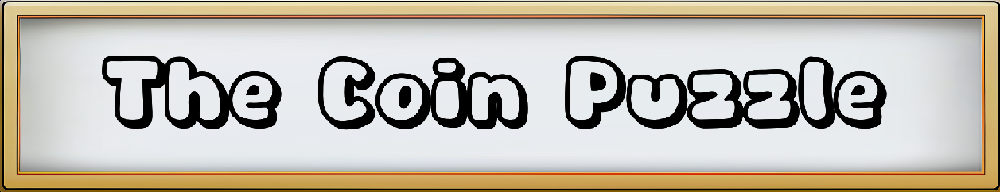
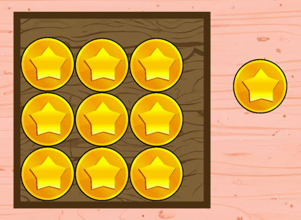

# The Coin Puzzle

To start the game, you can simply open `The Coin Puzzle.exe`.

This game is written in Godot 3.5, and this is my college assignment.

## Introduction
The coin puzzle is a puzzle game. The objective of this game is to insert all the coins into a puzzle in each level, then players will win the game. As the level increases, the puzzles become increasingly complex, so players are required to have a careful thought and creative approaches.

## Installation
You can download it on [itch.io](https://jie041214.itch.io/the-coin-puzzle)

## How to play
1. Long press the left mouse button to drag a coin.
2. Long press the right mouse button to pick up a coin for moving it into a puzzle.
3. Long press the right mouse button and Q/E to rotate a coin.
4. Click Esc to open the pause menu
5. Once all the coins are placed inside a puzzle, then the level is completed

## License
Published under MIT license but there are some assets that are for non-commercial uses only!

## Assets Sources
[Asset Sources](ASSETS.md)